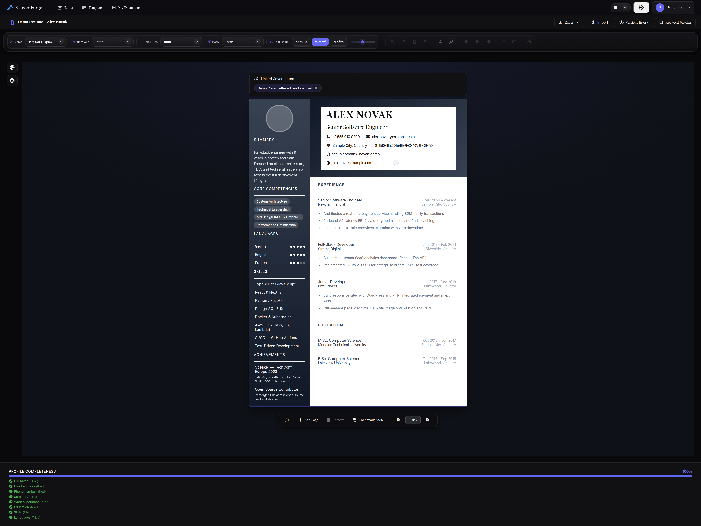
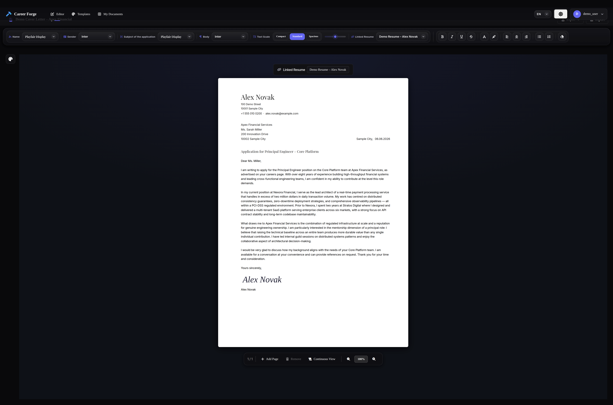
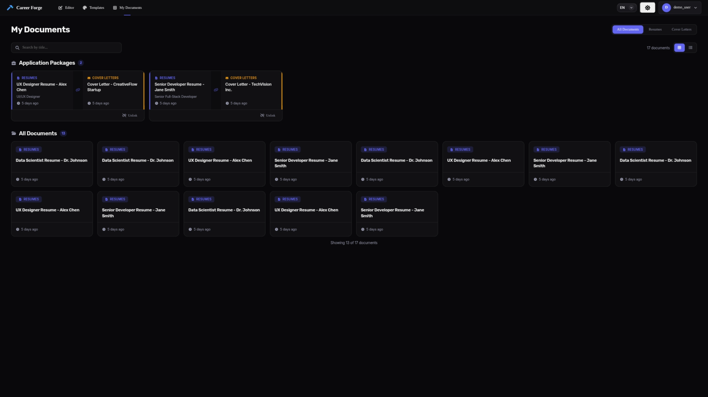
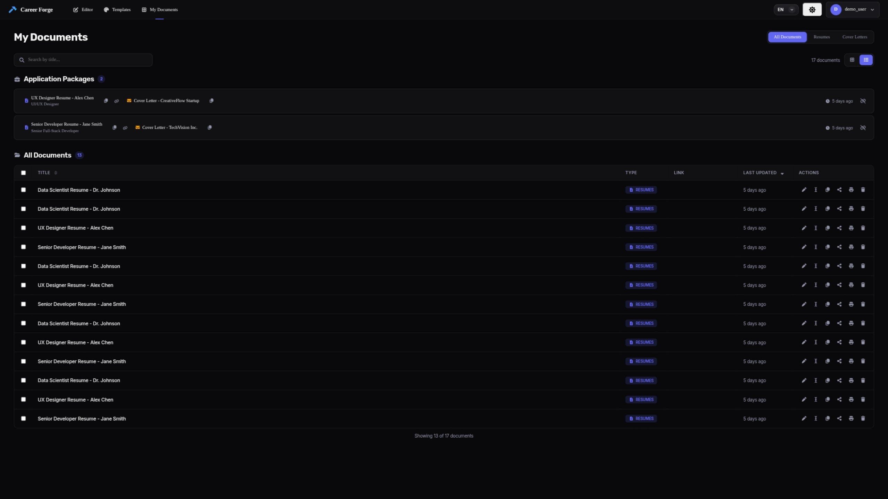
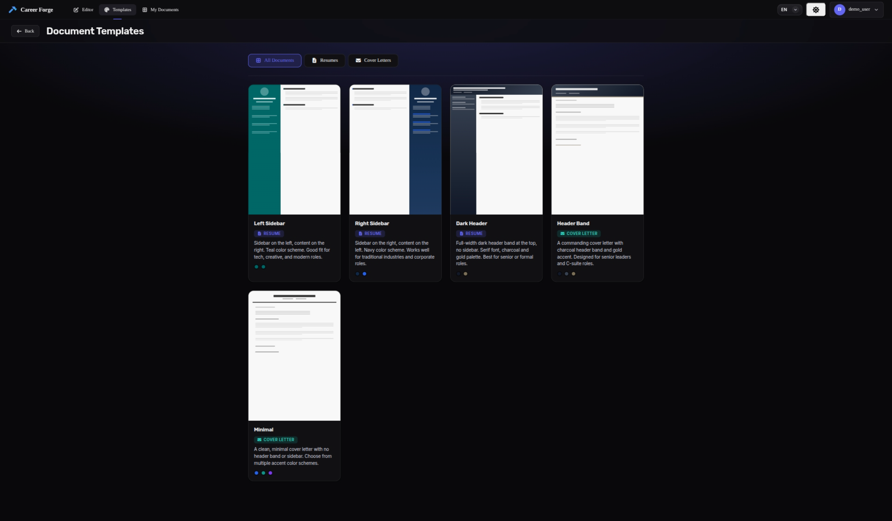

# Career Forge — Resume & Cover Letter Builder

> A full-stack, self-hostable resume and cover letter builder with a real-time WYSIWYG editor, multi-page A4 pagination, and a template system.

[](LICENSE)
[](https://github.com/wkarbowski/career-forge/actions/workflows/ci.yml)
[](server/tests/)
[](server/)
[](client/)
[](docker-compose.yml)

---

## Features

- **WYSIWYG inline editing** — click any field to edit in place; central editor toolbar for formatting
- **Multi-page A4 pagination** — page count calculated automatically from content height; zoom and view-mode controls
- **Cover letter editor** — dedicated DIN 5008-style cover letter editor with its own toolbar and layout
- **Template gallery** — professional, modern, and cover-letter templates with live colour previews
- **Document dashboard** — create, rename, search, sort, filter, and delete saved documents
- **Auth system** — register / login with JWT access tokens + HttpOnly-cookie refresh tokens; guest mode with no account required
- **PDF / Print export** — browser print via `window.print()` with print-optimised CSS that hides all UI chrome
- **JSON import / export** — full document backup and portability
- **Profile image upload** — upload and crop a photo directly from the editor
- **Version history** — create named snapshots and restore previous versions
- **Keyword matcher** — paste a job description and see matching keywords highlighted
- **Dark / Light theme** — persisted per user
- **Multi-language UI** — English and German locales (persisted per user)
- **Auto-save** — debounced background sync when authenticated
- **Security hardened** — rate limiting, CSRF protection, audit logging, account lockout, security headers

---

## Screenshots

**Resume editor** — inline editing, sidebar layout, linked cover letters, profile completeness bar:


**Cover letter editor** — DIN 5008-style layout with linked resume chip and live preview:


**Document dashboard (grid view)** — Application Packages grouping and card layout:


**Document dashboard (list view)** — sortable table with quick actions:


**Template gallery** — resume and cover letter templates with colour previews:


---

## Architecture

```
┌─────────────────────────────────────────────┐
│              Client (React 19)              │
│  Router v7 · 25+ Components · 6 Contexts   │
│          API Service (fetch + JWT)          │
└─────────────────┬───────────────────────────┘
                  │ HTTP (JSON + HttpOnly cookies)
┌─────────────────┴───────────────────────────┐
│           Server (FastAPI + Python)         │
│      7-layer middleware · Auth · Documents   │
│  SQLAlchemy ORM · Alembic migrations         │
│  PostgreSQL · Redis                          │
└─────────────────────────────────────────────┘
```

## Tech Stack

| Layer                 | Technology                        |
| --------------------- | --------------------------------- |
| Frontend              | React 19, React Router v7, Vite 8 |
| Fonts                 | 16× @fontsource/\* (self-hosted)  |
| Icons                 | Font Awesome Free 7 (self-hosted) |
| Sanitization          | DOMPurify 3                       |
| Backend               | FastAPI 0.136+, Python 3.12+      |
| ORM / Migrations      | SQLAlchemy 2, Alembic             |
| Database              | PostgreSQL 16                     |
| Cache / Rate Limiting | Redis 7                           |
| Containerization      | Docker + Docker Compose           |

---

## Quick Start

### With Docker (recommended)

```bash
git clone https://github.com/wkarbowski/career-forge.git career-forge
cd career-forge
# Create a .env file with required secrets — see docs/deployment.md for the full variable reference
docker compose up --build
# → http://localhost
```

### Local development

```bash
# Backend
cd server
python -m venv venv && source venv/bin/activate
pip install -r requirements.txt
# Create .env in the project root — see docs/deployment.md for all variables
uvicorn app.main:app --reload --port 8000

# Frontend (new terminal)
cd client
npm install
npm start
# → http://localhost:3000
```

See the full guides in [`docs/`](docs/):

| Guide                                  | Description                          |
| -------------------------------------- | ------------------------------------ |
| [Server Setup](docs/server-setup.md)   | Backend installation & configuration |
| [Client Setup](docs/client-setup.md)   | Frontend installation & development  |
| [Deployment](docs/deployment.md)       | Production deployment checklist      |
| [API Reference](docs/api-reference.md) | Complete REST API documentation      |
| [Architecture](docs/architecture.md)   | System design & data flow            |
| [Security](docs/security.md)           | Auth, middleware, audit logging      |

---

## Testing

### Backend Tests

Run the test suite with coverage:

```bash
cd server
python -m venv venv && source venv/bin/activate
pip install -r requirements-dev.txt
pytest
```

View coverage report:

```bash
pytest --cov-report=html
open htmlcov/index.html  # or xdg-open on Linux
```

### Frontend Tests

```bash
cd client
npm install
npm test
```

---

## Environment Variables

Create a `.env` file in the project root and set at minimum:

| Variable            | Required | Description                                   |
| ------------------- | -------- | --------------------------------------------- |
| `SECRET_KEY`        | **Yes**  | JWT signing key — `openssl rand -hex 32`      |
| `POSTGRES_PASSWORD` | Prod     | PostgreSQL password                           |
| `REDIS_PASSWORD`    | Prod     | Redis password (if using Redis rate limiting) |

See [docs/deployment.md](docs/deployment.md) for the full list of variables.

---

## Contributing

Contributions are welcome! Please read [CONTRIBUTING.md](CONTRIBUTING.md) first.

- Fork → branch → PR
- Keep changes focused; one logical change per PR
- Follow existing code style (Prettier / ESLint for JS, PEP 8 for Python)

---

## Security

Found a vulnerability? Please **do not open a public issue**.
Report it via [GitHub private security advisory](https://github.com/wkarbowski/career-forge/security/advisories/new).

See [SECURITY.md](SECURITY.md) for the full policy.

---

## License

[MIT](LICENSE) © 2026 Wiktor Karbowski

---

## Changelog

See [CHANGELOG.md](CHANGELOG.md) for the full history of releases.
